# 🏡 개요
***

**“AI  거주지 평가 시스템”**

‘하우스코어(HOUSCORE)’는 공공 데이터를 활용한 AI 거주지 (건물) 평가 시스템으로 사용자에게 거주지에 대한 평가를 제공합니다.

공인중개사들의 설문을 바탕으로 건물 정보, 인프라 시설, 교통, 치안, 실거래가 공공 데이터를 수집하여 사용자에게 해당 거주지의 AI 점수를 제공, 선택에 도움이 될 수 있도록 합니다.

원하는 거주지의 주소를 입력 하고 해당 거주지의 상세 정보와 지표 정보를 검색해보세요. AI 점수를 통해 해당 거주지의 객관적인 지표를 확인하고 실거주자의 평가 점수와 리뷰를 비교해 거주지를 선택할 수 있습니다.

***
# 🏡 서비스 소개
***

| 메인 페이지 |주소 검색|리뷰 작성|리뷰 작성2|전체 리뷰 페이지| 
|:----:|:----:|:----:|:----:|:----:|
|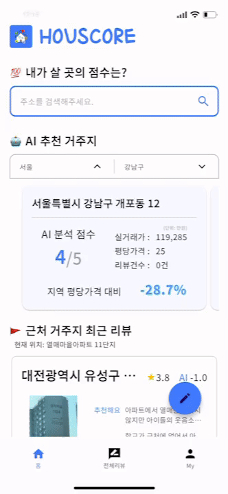||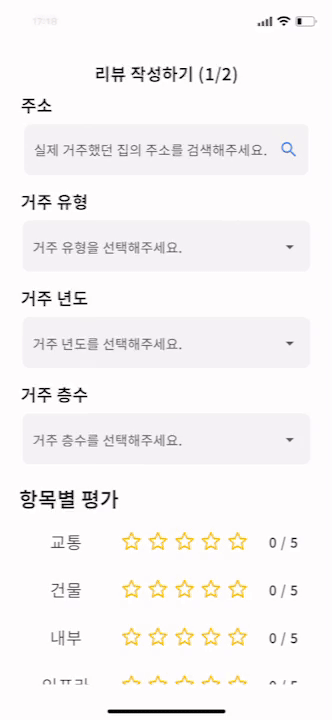|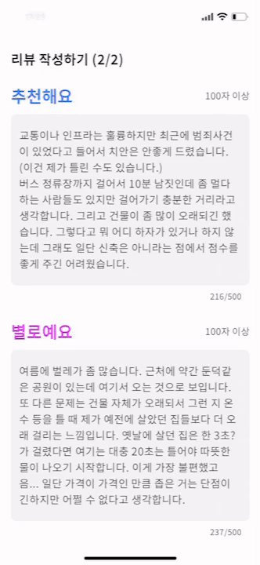|![wholereview]||

### 메인 화면

### 주소 검색

### 리뷰 작성

### 전체 리뷰 페이지

***
# 🏡 기술 스택
***
### 📱 Mobile
 

### 🛢 Backend
 

### 🤖 AI

### 💾 Database

### 🛠 Infra/CI

### 📅 Collaboration Tools

 

***
# 🏡 기술 아키텍쳐
***

***
# 🏡 AI
***
### 활용 공공데이터 구성
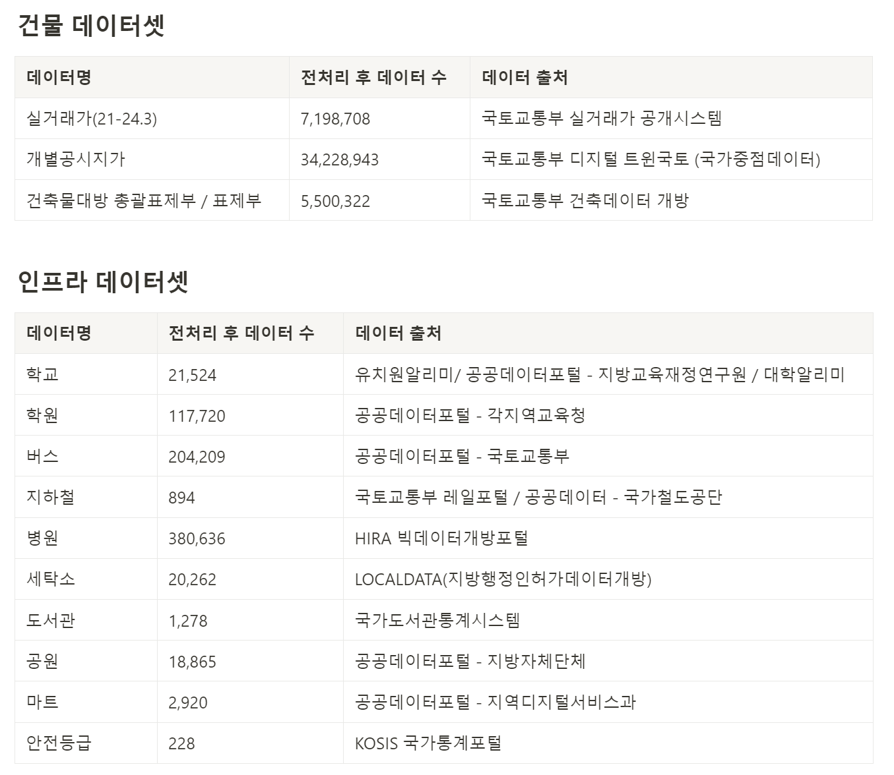

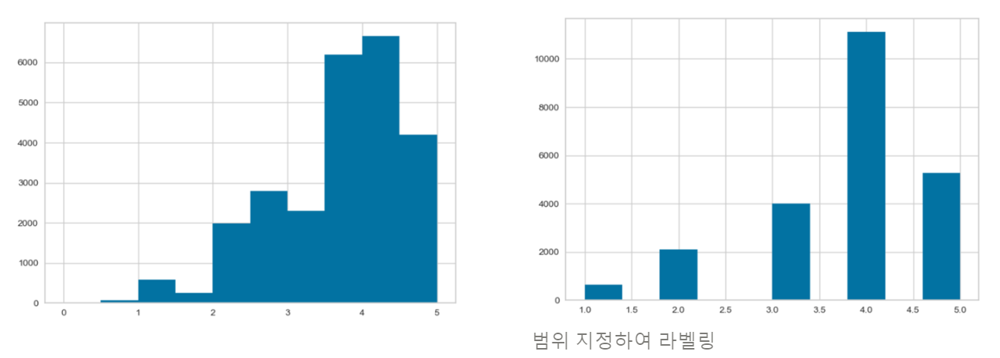
- 집품으로부터 제공받은 25,000건의 건물별 거주자 리뷰 평점 데이터와 공공데이터를 활용하여 리뷰가 없는 건물에 대해 예상 평점을 예측하는 모델을 만들고자 함
- 위와 같이 범위를 지정하여 라벨링을 진행한 결과 클래스별 데이터 불균형 존재
- pycaret automl을 사용하여 **classfication** 시도  
  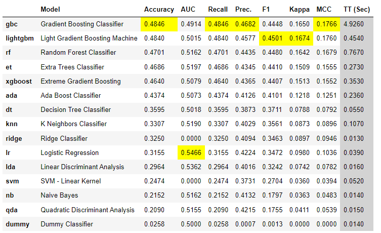
- 상위 모델 중 ligthtgbm, rf, xgboost를 채택하여 클래스별 데이터 불균형이 존재했기 때문에 SMOTE 기법을 활용하여 train 데이터셋에 대해 오버샘플링 진행
  - 각 모델 별 하이퍼파라미터 튜닝 후 Accuracy, AUC  
    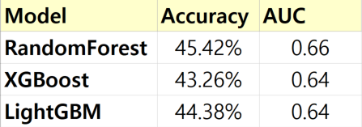 
  - 성능이 가장 좋은 **RandomForest 모델** 채택
  
###  SMOTE → StandardScaler → RandomForestClassifier
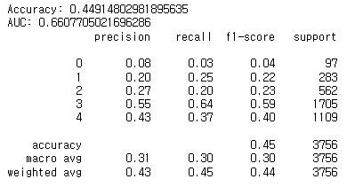 
기본 모델 **Accuracy : 44.9%**, **AUC: 0.66**  
하이퍼파라미터 튜닝 후 **Accuracy : 45.4%**, **AUC: 0.66**  
10번의 k-fold 교차검증 진행 **Accuracy : 42.5%**, **AUC: 0.66**  
### 변수 중요도
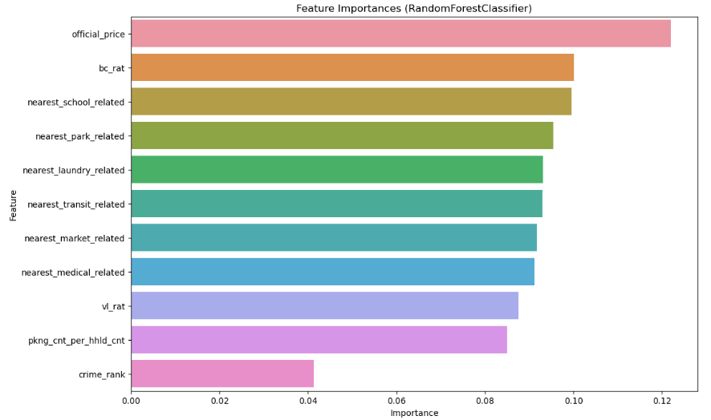 
### 혼동행렬
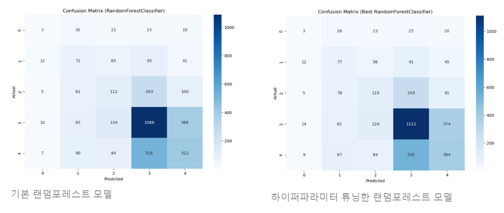 

***
# 🏡 팀 소개
***

### 👑 박영규
- 팀장(PM), 발표
- Backend Springboot OAuth2 소셜로그인, JWT, S3 연결, Mainpage API 개발
- Infra 및 CI/CD 전반

### 🐲 안상준
- Mobile 팀원, 서기, 노션 관리, 멘토링 보고
- 메인 페이지, 거주지 관련 컴포넌트, 디자인

### 🐑희태
- Mobile 리더
- 프로젝트 구조 설계, 코드 제네레이션, 페이지네이션 상태관리, 인증 처리, 디자인

### 🏊‍ 천우진
- Mobile, 멘토링 보고
- 리뷰 CRUD 페이지 및 기능 구현

### 🧗‍ 정종욱
- 인프라 데이터 전처리,AI
- UCC 담당

### 🐶 김희주
- Backend 리더
- 건물 정보 Batch, 거주지 관련 조회 API, 리뷰 CRUD, 관심지역 CRUD

### 🐻 안성재
- AI 리더, 서기, 멘토링 보고
- 공공데이터 수집/전처리/적재, AI, fastapi 서버 구현 및 연결

### 👥 팀 관리
- `Jira`를 이용한 일정 관리
- **총 784개의 이슈**

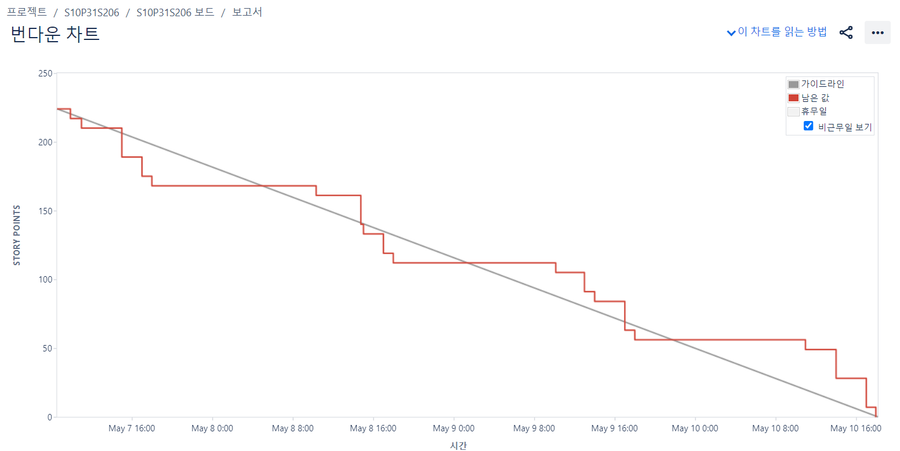

- `Gerrit`을 이용한 코드 리뷰

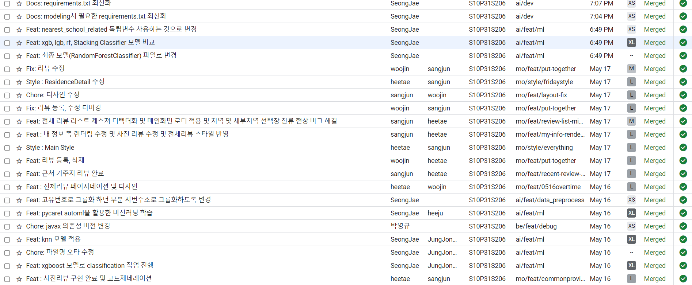

***
# 🏡 관련 문서
***

##  [Team Notion](https://faceted-scallion-14e.notion.site/HOUSCORE-248c8513604545e6af56f22a9d82c0e9?pvs=4)

## [프로젝트 소개 PPT](https://www.miricanvas.com/v/137to7g)

